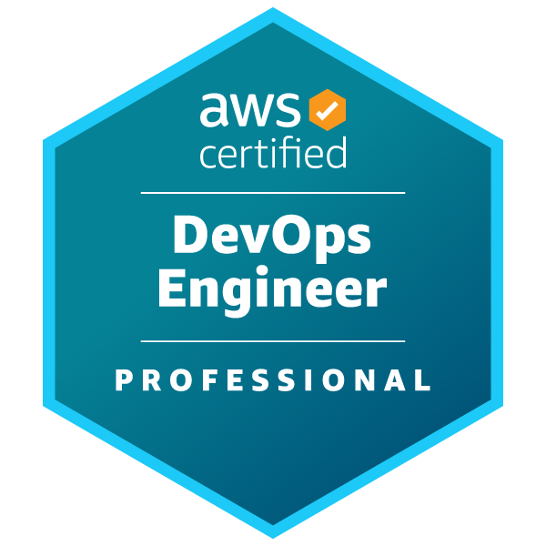

### Hello world, I'm Jin.
<!---->
<!---->

### 🎯 Project

- **Bespin Global** - *DevOps Team* **✓**
  - SK Broadband Co., Ltd. - Jenkins Pipeline Enhancement Project. CI/CD automation and pipeline optimization
  - Presidential Committee on Policy Planning(국정기획위원회) - "모두의 광장" Project. Public engagement platform for citizen proposals and discussions
  - AWS ECIRA Advanced Security Architecture Program - Specialized training on enterprise cloud security infrastructure and architecture optimization
  - SK Telecom Co., Ltd. - Cloud Radar Enhancement Project
  - Samsung Electronics Co., Ltd. GateKeeper PJT - Relay and request propagation system
- **BSG Partners** - *Cloud MSP Team*
  - Samsung E&A Co., Ltd. Engineering Cloud Platform PJT - Data ETL, Serverless with AWS resource
  - BSGON Applications System Management
  - Soulbrain Co.,Ltd. Analytics Process Platform Development Project 
- **Netive** - *Development Team*
  - Kyobo Life Insurance Co., Ltd. Build a mobile subscription process
  - Hanwha General Insurance Co., Ltd. Advancing SmartInsure
  - DB Insurance Co., Ltd. Renewing the main homepage
  - AIA Life Insurance Co. Ltd. Vitality Digital Direct Platform

 📘 **Blog.** https://jaylab.vercel.app/ 
<!---->

<!--
<h2>⚡️ A Few Quick Facts</h2>
<h2>✒️ Recent Posts</h2>

    
Explore

    <li><a target="_blank" href="https://blog.stanleylim.me/airpods-not-charging-on-windows">Airpods Not Charging on Windows — August 19, 2022</a></li><li><a target="_blank" href="https://blog.stanleylim.me/the-fastest-way-to-develop-and-deploy-your-next-project">⚡ The Fastest Way to Develop and Deploy Your Next Project — June 09, 2022</a></li><li><a target="_blank" href="https://blog.stanleylim.me/the-browser-in-the-browser-(bitb)-attack---lies,-deceit,-and-css">The Browser in the Browser (BITB) Attack - Lies, Deceit, and CSS — March 30, 2022</a></li><li><a target="_blank" href="https://blog.stanleylim.me/why-i-unit-test-my-sass---mixins">Why I Unit Test My Sass - Mixins — January 31, 2022</a></li><li><a target="_blank" href="https://blog.stanleylim.me/why-i-unit-test-my-sass---functions">Why I Unit Test My Sass - Functions — January 10, 2022</a></li>

<a target="_blank" href="https://blog.stanleylim.me">Read More</a>

-->

<!--

-->

<!---->

 

 

<!---->

<!---->

<!--

-->
