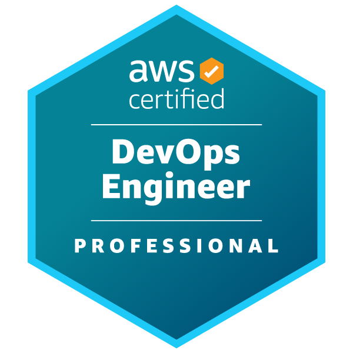
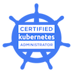

### Hello world, I'm Jin.
<!---->
<!---->

<!-- =================================================================== -->
<!-- 프로젝트 경험 -->
<!-- =================================================================== -->
<!--
### 🎯 Project

- **Bespin Global** - *DevOps Team* **✓**
  - Samsung C&T Corporation - Homeniq SaaS Platform PJT. Multi-tenant SaaS platform on AWS EKS with GitOps-based tenant onboarding automation
  - SK Broadband Co., Ltd. - Jenkins Pipeline Enhancement Project. CI/CD automation and pipeline optimization
  - Presidential Committee on Policy Planning(국정기획위원회) - "모두의 광장" Project. Public engagement platform for citizen proposals and discussions
  - AWS ECIRA Advanced Security Architecture Program - Specialized training on enterprise cloud security infrastructure and architecture optimization
  - SK Telecom Co., Ltd. - Cloud Radar Enhancement Project
  - Samsung Electronics Co., Ltd. GateKeeper PJT - Relay and request propagation system
- **BSG Partners** - *Cloud MSP Team*
  - Samsung E&A Co., Ltd. Engineering Cloud Platform PJT - Data ETL, Serverless with AWS resource
  - BSGON Applications System Management
  - Soulbrain Co.,Ltd. Analytics Process Platform Development Project 
- **Netive** - *Development Team*
  - Kyobo Life Insurance Co., Ltd. Build a mobile subscription process
  - Hanwha General Insurance Co., Ltd. Advancing SmartInsure
  - DB Insurance Co., Ltd. Renewing the main homepage
  - AIA Life Insurance Co. Ltd. Vitality Digital Direct Platform
-->
### Career

### Bespin Global · DevOps Team
`2023.01 – Present` · DevOps Engineer

- **Samsung C&T** — Homeniq SaaS Platform
  AWS EKS 기반 멀티테넌트 SaaS 플랫폼 구축, GitOps 기반 테넌트 온보딩 자동화
- **SK Broadband** — Jenkins Pipeline Enhancement
  Jenkins CI/CD 파이프라인 자동화 및 최적화
- **Presidential Committee on Policy Planning (국정기획위원회)** — "모두의 광장"
  국민 제안·토론을 위한 공공 참여 플랫폼 구축
- **SK Telecom** — Cloud Radar Enhancement
  Cloud Radar 플랫폼 기능 고도화
- **Samsung Electronics** — GateKeeper
  요청 중계 및 전파 시스템 구축

### BSG Partners · Cloud MSP Team
`2021.07 – 2022.12` · DevOps Engineer

- **Samsung E&A** — Engineering Cloud Platform (ECP)
  AWS 서버리스 기반 데이터 ETL 파이프라인 구축 (API Gateway, Lambda, Glue, DataSync, RDS)
- **BSG Partners (in-house)** — BSGON System Management
  자사 클라우드 비용 관제 솔루션 운영 및 개발 (Django, MongoDB, PostgreSQL)
- **Soulbrain** — AI Analytics Platform Development
  AWS 서버리스 스택 기반 애플리케이션 개발 (Amplify, API Gateway, Lambda, S3)

### Netive · Development Team
`2019.03 – 2021.06` · Backend Developer

- **Kyobo Life Insurance** — Mobile Subscription & Customer Proposal System
  프론트엔드·백엔드 개발 (Spring, Java, JSP, Oracle)
- **Hanwha General Insurance** — SmartInsure Enhancement
  프론트엔드·백엔드 개발 (Spring, Java, JSP, Oracle)
- **DB Insurance** — Main Homepage Renewal
  프론트엔드·백엔드 개발 (Spring, Java, JSP, Oracle)
- **AIA Life Insurance** — Vitality Digital Direct Platform
  프론트엔드·백엔드 개발 (Spring, Java, MyBatis, Oracle)
- **Samsung Life Insurance** — Direct Channel Enhancement
  백엔드 개발 (Spring, Java, JSP)

## Training

- **AWS ECIRA Advanced Security Architecture Program** · `2024.12 – 2025.03`
  엔터프라이즈 클라우드 보안 인프라 및 아키텍처 최적화 전문 교육

<!-- =================================================================== -->
<!-- 블로그 링크 -->
<!-- =================================================================== -->
 📘 **Blog.** https://jaylab.vercel.app/ 
<!---->

<!-- =================================================================== -->
<!-- 타이핑 GIF -->
<!-- =================================================================== -->

<!-- =================================================================== -->
<!-- Profile Summary Cards -->
<!-- =================================================================== -->

<!-- =================================================================== -->
<!-- (BACKUP) Readme Stats-->
<!-- =================================================================== -->
<!---->
<!--
-->

<!-- =================================================================== -->
<!-- 기술 스택 -->
<!-- =================================================================== -->

<!---->

 

 

<!---->

<!---->

<!-- =================================================================== -->
<!-- Certification -->
<!-- =================================================================== -->

<!-- =================================================================== -->
<!-- Footer -->
<!-- =================================================================== -->

<!-- =================================================================== -->
<!-- (BACKUP) Footer -->
<!-- =================================================================== -->
<!--

-->
